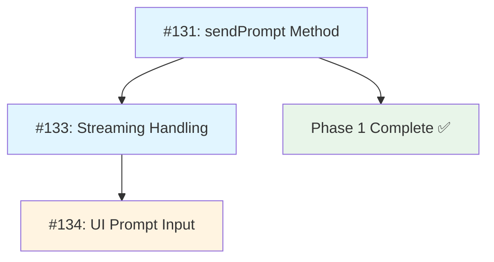

# Phase 2 Implementation Plan: ACP Write Operations + Streaming

**Status:** APPROVED - Ready for Implementation  
**Created:** 2026-02-17  
**Prerequisites:** Phase 1 complete ✅ (PR #143)  
**Goal:** Enable sending prompts to Copilot ACP sessions with streaming response handling

---

## Entry Gate

Plan reviewed and approved by project maintainer (2026-02-17). ✅

Phase 2 implementation is authorized. Phase 2 introduces write operations and bidirectional streaming—changes that touch multiple layers and require careful coordination.

**Implementation status:** Ready for implementation.

---

## Executive Summary

Phase 2 extends the read-only Copilot ACP integration (Phase 1) with write capabilities:
- **Send prompts** to Copilot sessions via JSON-RPC `sendPrompt` method
- **Stream responses** incrementally as ACP emits update events
- **Parse and aggregate** streaming chunks into timeline events
- **Handle errors** gracefully with ACP-specific failure modes

This enables a full conversation loop: users can send prompts to Copilot sessions and watch responses stream in real-time, matching the UX quality of native Codex app-server sessions.

---

## Architecture Changes

### 1. JSON-RPC Method Mapping

**Current state (Phase 1):**
- `AcpClient` implements generic JSON-RPC request/response patterns
- Only `listSessions` method tested and wired
- Notifications handled but not routed

**Phase 2 additions:**

#### `sendPrompt` Method
```typescript
// JSON-RPC structure
{
  "jsonrpc": "2.0",
  "id": 42,
  "method": "sendPrompt",
  "params": {
    "sessionId": "copilot-session-xyz",
    "input": {
      "text": "Explain this function",
      "attachments": [] // Optional
    },
    "options": {
      "mode": "auto",
      "model": "gpt-4" // Provider-specific
    }
  }
}
```

**Response:**
```json
{
  "jsonrpc": "2.0",
  "id": 42,
  "result": {
    "turnId": "turn-123",
    "status": "streaming"
  }
}
```

**Design notes:**
- Response is synchronous (request acknowledgment)
- Actual content arrives via **notifications** (streaming chunks)
- Must correlate notifications with turnId for multi-session support

### 2. Bidirectional Streaming Architecture

**Current AcpClient streaming:**
- Reads NDJSON from `process.stdout` ✅
- Writes requests to `process.stdin` ✅
- Notification handler registration exists but unused

**Phase 2 enhancements:**

#### Notification Router
```typescript
class AcpClient {
  private eventHandlers = new Map<string, EventHandler[]>();

  /**
   * Register handler for specific session's events
   */
  onSessionEvent(sessionId: string, handler: (event: AcpEvent) => void): void {
    if (!this.eventHandlers.has(sessionId)) {
      this.eventHandlers.set(sessionId, []);
    }
    this.eventHandlers.get(sessionId)!.push(handler);
  }

  /**
   * Remove session handlers
   */
  offSessionEvent(sessionId: string, handler: EventHandler): void {
    const handlers = this.eventHandlers.get(sessionId);
    if (handlers) {
      const idx = handlers.indexOf(handler);
      if (idx !== -1) handlers.splice(idx, 1);
    }
  }
}
```

**Notification flow:**
1. `sendPrompt()` call returns `turnId`
2. Client subscribes to session events via `onSessionEvent(sessionId, callback)`
3. ACP emits notifications: `{"jsonrpc":"2.0","method":"update","params":{"sessionId":"...","update":...}}`
4. Client parses notification, extracts `sessionId`, routes to registered handlers
5. Handler aggregates chunks, normalizes to `NormalizedEvent`, emits to subscribers

### 3. Response Chunk Parsing and Aggregation

**ACP update notification structure (inferred from protocol):**
```json
{
  "jsonrpc": "2.0",
  "method": "update",
  "params": {
    "sessionId": "session-xyz",
    "turnId": "turn-123",
    "update": {
      "type": "content",
      "delta": "Here is the explanation...",
      "done": false
    }
  }
}
```

**Update types (expected):**
- `content` - Text delta (agent message)
- `reasoning` - Reasoning/thinking delta
- `tool` - Tool invocation/result
- `status` - Lifecycle events (started, completed, error)
- `done` - Final marker (done: true)

**Aggregation strategy:**

```typescript
interface StreamingContext {
  sessionId: string;
  turnId: string;
  chunks: ChunkBuffer[]; // Accumulate deltas
  lastTimestamp: string;
  category: EventCategory; // Inferred from update.type
}

class ACPEventNormalizer {
  private contexts = new Map<string, StreamingContext>();

  handleUpdate(notification: AcpUpdateNotification): NormalizedEvent | null {
    const { sessionId, turnId, update } = notification.params;
    const key = `${sessionId}:${turnId}`;

    // Get or create context
    let ctx = this.contexts.get(key);
    if (!ctx) {
      ctx = this.createContext(sessionId, turnId, update.type);
      this.contexts.set(key, ctx);
    }

    // Append delta
    if (update.delta) {
      ctx.chunks.push({
        delta: update.delta,
        timestamp: new Date().toISOString(),
      });
    }

    // Emit event on done marker or significant update
    if (update.done || this.shouldFlush(ctx, update)) {
      const event = this.flushContext(ctx);
      if (update.done) {
        this.contexts.delete(key); // Clean up
      }
      return event;
    }

    return null; // Still accumulating
  }

  private flushContext(ctx: StreamingContext): NormalizedEvent {
    const text = ctx.chunks.map(c => c.delta).join('');
    
    return {
      provider: 'copilot-acp',
      sessionId: ctx.sessionId,
      eventId: `${ctx.turnId}-${Date.now()}`,
      category: ctx.category,
      timestamp: ctx.lastTimestamp || new Date().toISOString(),
      text,
      payload: {
        turnId: ctx.turnId,
        chunks: ctx.chunks,
      },
      rawEvent: ctx, // Preserve full streaming context
    };
  }
}
```

**Design decisions:**
- **Flush strategy:** Flush on `done` marker OR when switching between content types (e.g., content → reasoning)
- **Category mapping:**
  - `content` → `agent_message`
  - `reasoning` → `reasoning`
  - `tool` → `tool_command`
  - `status` → `lifecycle_status`
- **Partial updates:** Optionally emit partial events for real-time UI updates (configurable)

### 4. Error Handling for ACP-Specific Failures

**Error categories:**

#### Protocol errors (JSON-RPC level)
```json
{
  "jsonrpc": "2.0",
  "id": 42,
  "error": {
    "code": -32600,
    "message": "Invalid Request",
    "data": { "reason": "Missing sessionId" }
  }
}
```

**Handling:** Reject promise with structured error

#### Session-level errors (notification)
```json
{
  "jsonrpc": "2.0",
  "method": "update",
  "params": {
    "sessionId": "session-xyz",
    "turnId": "turn-123",
    "update": {
      "type": "error",
      "error": {
        "code": "RATE_LIMIT",
        "message": "Rate limit exceeded"
      }
    }
  }
}
```

**Handling:** Emit `lifecycle_status` event with error category

#### Streaming interruption (mid-response)
- TCP connection drops
- Process crash
- Timeout waiting for chunks

**Handling:**
- Set timeout for final `done` marker (30s default)
- On timeout, flush partial context and emit error event
- Mark session as `interrupted` status

**Error normalization:**
```typescript
function normalizeError(error: AcpError): NormalizedEvent {
  return {
    provider: 'copilot-acp',
    sessionId: error.sessionId,
    eventId: `error-${Date.now()}`,
    category: 'lifecycle_status',
    timestamp: new Date().toISOString(),
    text: `Error: ${error.message}`,
    payload: {
      errorCode: error.code,
      errorType: classifyError(error.code),
      recoverable: isRecoverable(error.code),
    },
    rawEvent: error,
  };
}

function classifyError(code: string): string {
  const categories: Record<string, string> = {
    'RATE_LIMIT': 'rate_limit',
    'AUTH_FAILED': 'authentication',
    'SESSION_NOT_FOUND': 'not_found',
    'INVALID_INPUT': 'validation',
  };
  return categories[code] || 'unknown';
}
```

---

## Issue Breakdown

Issue mapping clarification:
- Umbrella/planning container: #131
- Detailed planning references: #133, #134
- Implementation task tracking: #144 (`sendPrompt`), #145 (streaming), #146 (UI prompt input)

### Issue #131: ACP Write Capability - sendPrompt Method

Implementation tracking issue: #144

**Scope:** Implement `sendPrompt()` method in `CopilotAcpAdapter` with basic request/response handling.

**Acceptance Criteria:**
1. ✅ `adapter.sendPrompt(sessionId, input, options)` sends JSON-RPC request
2. ✅ Returns `{ turnId, status }` on successful acknowledgment
3. ✅ Throws structured error on JSON-RPC error response
4. ✅ Validates input before sending (non-empty text, valid sessionId)
5. ✅ Times out after 5s if no response received
6. ✅ Unit tests cover success, validation errors, timeout, JSON-RPC errors

**File Blast Radius:**
```
services/local-orbit/src/providers/adapters/copilot-acp-adapter.ts
  - Implement sendPrompt() method body
  - Add input validation helper
  - Update capabilities: sendPrompt = true

services/local-orbit/src/providers/adapters/acp-client.ts
  - No changes (sendRequest already generic)

services/local-orbit/src/providers/adapters/__tests__/copilot-acp-adapter.test.ts
  - Add sendPrompt test cases (6+ tests)
```

**Dependencies:**
- Phase 1 complete ✅
- No blockers

**Testing Strategy:**
```typescript
describe("CopilotAcpAdapter.sendPrompt", () => {
  it("sends valid prompt and returns turnId", async () => {
    // Mock AcpClient.sendRequest
    // Call adapter.sendPrompt(sessionId, { text: "Hello" })
    // Assert JSON-RPC message structure
    // Assert turnId in response
  });

  it("throws on empty prompt text", async () => {
    // Expect validation error before RPC call
  });

  it("throws on JSON-RPC error response", async () => {
    // Mock error: { code: -32600, message: "Invalid Request" }
    // Assert error structure
  });

  it("times out after 5 seconds", async () => {
    // Mock slow response
    // Assert timeout error
  });
});
```

**Non-Goals:**
- Streaming response handling (see #133)
- UI integration (separate PR)
- Retry logic (Phase 5)

---

### Issue #133: Streaming Response Handling

Implementation tracking issue: #145

**Scope:** Parse ACP update notifications, aggregate chunks, and emit normalized events to subscribers.

**Acceptance Criteria:**
1. ✅ `AcpClient` routes notifications to session-specific handlers
2. ✅ `ACPEventNormalizer` aggregates streaming chunks by turnId
3. ✅ Emits `NormalizedEvent` on `done` marker or flush trigger
4. ✅ Maps ACP update types to event categories correctly
5. ✅ Handles partial/incomplete streams (timeout, cleanup)
6. ✅ Preserves raw notification payloads in `rawEvent` field
7. ✅ Unit tests for aggregation, flushing, timeout, category mapping

**File Blast Radius:**
```
services/local-orbit/src/providers/adapters/acp-client.ts
  - Add onSessionEvent(sessionId, handler)
  - Add offSessionEvent(sessionId, handler)
  - Route notifications to session handlers

services/local-orbit/src/providers/normalizers/acp-event-normalizer.ts (NEW)
  - Implement ACPEventNormalizer class
  - Streaming context management
  - Chunk aggregation and flushing
  - Category mapping

services/local-orbit/src/providers/adapters/copilot-acp-adapter.ts
  - Implement subscribe() method
  - Wire up event normalizer
  - Update capabilities: streaming = true

services/local-orbit/src/providers/normalizers/__tests__/acp-event-normalizer.test.ts (NEW)
  - Test chunk aggregation
  - Test category mapping
  - Test timeout/cleanup
  - Test partial stream handling
```

**Dependencies:**
- #131 (sendPrompt must be functional to generate turnIds)

**Testing Strategy:**
```typescript
describe("ACPEventNormalizer", () => {
  it("aggregates content deltas into single event", () => {
    const normalizer = new ACPEventNormalizer();
    
    // Emit 3 chunks
    const evt1 = normalizer.handleUpdate({ type: 'content', delta: 'Hello ', done: false });
    const evt2 = normalizer.handleUpdate({ type: 'content', delta: 'world', done: false });
    const evt3 = normalizer.handleUpdate({ type: 'content', delta: '!', done: true });
    
    expect(evt1).toBeNull(); // Still accumulating
    expect(evt2).toBeNull();
    expect(evt3).toMatchObject({
      category: 'agent_message',
      text: 'Hello world!',
    });
  });

  it("flushes context when switching types", () => {
    // content chunk → reasoning chunk triggers flush
  });

  it("handles timeout for incomplete stream", async () => {
    // Emit content chunk without done marker
    // Wait 30s
    // Assert partial event emitted with error
  });

  it("maps ACP update types to event categories", () => {
    // content → agent_message
    // reasoning → reasoning
    // tool → tool_command
    // status → lifecycle_status
  });
});
```

**Non-Goals:**
- Optimistic UI updates (out of scope)
- Advanced partial rendering (Phase 4)
- Backpressure/flow control (Phase 5)

---

### Issue #134: UI Prompt Input for Copilot Sessions

Implementation tracking issue: #146

**Scope:** Enable prompt composer for Copilot sessions in thread detail view, with appropriate UX affordances for write operations.

**Acceptance Criteria:**
1. ✅ Prompt composer enabled when viewing Copilot session (if `sendPrompt` capability true)
2. ✅ Send button triggers `rpc.sendPrompt(sessionId, { text })` via relay
3. ✅ Streaming responses appear in timeline incrementally
4. ✅ Error messages shown inline for failed prompts (rate limit, validation, etc.)
5. ✅ Composer disables during send (prevents double-send)
6. ✅ Read-only badge/notice hidden when write enabled

**File Blast Radius:**
```
services/local-orbit/src/index.ts
  - Remove read-only guard for ACP sessions (keep guard structure for other checks)
  - Route sendPrompt RPC to provider adapter
  - Wire streaming events to WebSocket subscribers

src/routes/ThreadDetail.svelte
  - Check provider capabilities before enabling composer
  - Display "Copilot Session" provider badge
  - Handle streaming events (partial updates)

src/lib/components/Composer.svelte
  - No structural changes (already supports send callback)
  - Add loading state during send
```

**Dependencies:**
- #131 (sendPrompt backend)
- #133 (streaming support)

**Testing Strategy:**
- Manual E2E test script:
  1. Open Copilot session in Home UI
  2. Verify composer is enabled
  3. Send prompt "What is this repo about?"
  4. Verify streaming response appears incrementally
  5. Verify final done marker completes message
  6. Send invalid prompt (empty string) → verify error toast
  7. Rate limit test (send 10 prompts rapidly) → verify graceful error

**Non-Goals:**
- Attachment support (Phase 4)
- Multi-turn context management (Phase 4)
- Advanced composer features (templates, etc.)

---

## Dependencies and Sequencing



**Critical path:** #131 → #133 → #134  
**Parallelization:** None (strict dependency chain)

**Implementation issue critical path:** #144 → #145 → #146

**Rationale:**
- #131 must work before streaming tests can verify turnId correlation
- #133 must work before UI can display incremental updates
- #134 is pure UI integration, safe to implement last

---

## Risk Table

| Risk | Probability | Impact | Mitigation |
|------|-------------|--------|------------|
| **Protocol drift** (ACP updates between preview versions) | Medium | High | Pin tested CLI versions in docs, add version detection in health check, fail gracefully on unknown message formats |
| **Partial capability support** (ACP doesn't support expected methods) | Low | Medium | Capability flags prevent UI from exposing unsupported features, health check reports missing methods |
| **Provider failure isolation** (ACP crash kills local-orbit) | Low | High | Process supervision with restart policy (Phase 5), graceful degradation preserves Codex sessions |
| **Streaming errors mid-response** | Medium | Medium | Timeout-based cleanup (30s), emit partial content + error event, mark turn as interrupted |
| **Rate limiting from Copilot backend** | Medium | Low | Parse rate limit errors, surface to user with retry guidance, add exponential backoff (Phase 5) |
| **JSON-RPC correlation failures** (wrong turnId, duplicate IDs) | Low | Medium | Strict ID validation, log warnings for orphaned notifications, drop unmatched events |
| **Memory leaks from unbounded chunk buffers** | Low | Medium | Limit max chunks per streaming context (1000), force-flush on limit, emit warning event |

---

## Testing Strategy

### Unit Tests

**Coverage targets:**
- `CopilotAcpAdapter.sendPrompt()`: 90%+ (input validation, error cases, timeout)
- `ACPEventNormalizer`: 95%+ (aggregation logic, category mapping, flush triggers)
- `AcpClient` notification routing: 85%+

**Tools:** Bun test framework, mock child processes, mock notification streams

### Integration Tests

**Scope:** Full request-response cycle with mock ACP process

```typescript
describe("ACP Write Operations (Integration)", () => {
  it("sends prompt and receives streaming response", async () => {
    // Setup: Spawn mock ACP process that emits canned notifications
    const adapter = new CopilotAcpAdapter({ /* mock config */ });
    await adapter.start();

    // Subscribe to events
    const events: NormalizedEvent[] = [];
    await adapter.subscribe('session-1', (evt) => events.push(evt));

    // Send prompt
    const result = await adapter.sendPrompt('session-1', { text: 'Hello' });
    expect(result.turnId).toBeDefined();

    // Wait for done marker
    await waitFor(() => events.some(e => e.payload?.done === true), { timeout: 5000 });

    // Assert final event
    const finalEvent = events[events.length - 1];
    expect(finalEvent.category).toBe('agent_message');
    expect(finalEvent.text).toContain('mock response');
  });
});
```

### Manual E2E Tests

**Test script:** `scripts/test-acp-write.sh`

```bash
#!/bin/bash
# Prerequisites:
# - Copilot CLI installed and authenticated
# - local-orbit running
# - Copilot session visible in Home UI

echo "=== Phase 2 E2E Test: ACP Write Operations ==="

echo "1. Testing sendPrompt..."
curl -X POST http://localhost:8790/rpc \
  -H "Authorization: Bearer $TOKEN" \
  -d '{
    "jsonrpc": "2.0",
    "id": 1,
    "method": "sendPrompt",
    "params": {
      "sessionId": "copilot-session-xyz",
      "input": { "text": "What is 2+2?" }
    }
  }'

echo "2. Verifying streaming events..."
# WebSocket client script to listen for events

echo "3. Testing error handling (empty prompt)..."
# ...

echo "✅ All E2E tests passed"
```

---

## Rollback Plan

**If Phase 2 introduces regressions:**

1. **Immediate:** Revert PR merge, redeploy Phase 1 state
2. **Capability flags:** Set `sendPrompt: false` and `streaming: false` in adapter to disable features without code rollback
3. **Graceful degradation:** Read-only guard remains in place as fallback (can be toggled via config)

**Health check additions:**
```typescript
async health(): Promise<ProviderHealthStatus> {
  // Existing checks...
  
  // Phase 2 check: Verify sendPrompt capability
  try {
    const canWrite = await this.testWriteCapability();
    if (!canWrite) {
      return {
        status: 'degraded',
        message: 'Write operations unavailable',
        details: { capability: 'sendPrompt', available: false },
        lastCheck: new Date().toISOString(),
      };
    }
  } catch (err) {
    // Non-fatal: degrade to read-only
  }
  
  return { status: 'healthy', ... };
}
```

---

## Success Criteria

**Phase 2 is complete when:**

1. ✅ All unit tests pass (`bun test` in services/local-orbit)
2. ✅ TypeScript compilation clean (`bunx tsc --noEmit`)
3. ✅ Integration test suite passes (mock ACP streaming)
4. ✅ Manual E2E test script passes with live Copilot CLI
5. ✅ User can send prompt to Copilot session and receive streaming response
6. ✅ Error cases handled gracefully (validation, rate limit, timeout)
7. ✅ No regressions to Phase 1 read-only functionality
8. ✅ No regressions to existing Codex app-server behavior
9. ✅ Documentation updated (PROVIDERS.md, CHANGELOG.md)
10. ✅ Code review approved by 1+ reviewers

---

## Post-Phase 2 State

**Capabilities enabled:**
- ✅ Read Copilot sessions (Phase 1)
- ✅ Send prompts to Copilot (Phase 2)
- ✅ Stream responses incrementally (Phase 2)

**Capabilities deferred:**
- ⏸️ Attachments (Phase 4)
- ⏸️ Approvals/user input requests (Phase 4)
- ⏸️ Advanced filtering and view persistence (Phase 4)
- ⏸️ Multi-provider reliability hardening (Phase 5)

**Next phase:** Phase 4 — Capability Matrix + Graceful Degrade (optional enhancements)

---

## Implementation Authorization

**Approved by:** Project Maintainer
**Date:** February 17, 2026
**Status:** Ready to proceed with Phase 2 implementation

Implementation may begin on issues #144, #145, #146 in sequence.

---

## References

- **Phase 1 Implementation:** PR #143
- **ACP Protocol:** (GitHub Copilot CLI documentation - to be linked when available)
- **Provider Contracts:** `services/local-orbit/src/providers/contracts.ts`
- **Integration Epic:** `docs/ACP_CODEX_INTEGRATION_EPIC.md`

